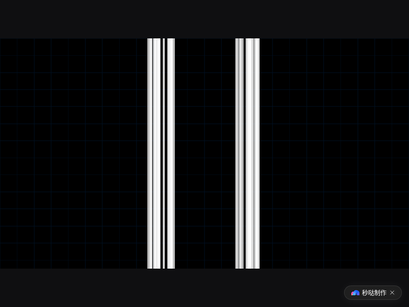

# 🎮 几何决斗 | Geometry Duel

> 一款网页 2D 几何风格射击游戏 — 移动、射击、闪避、弹反，在像素化的竞技场中击败所有敌人！

<p align="center">
  
</p>

## 🎯 在线试玩

🔗 **[即开即玩](https://app-cxzb1vg4g7wh.appmiaoda.com)** — 无需下载，浏览器直接打开！

---

## 🕹️ 操作说明

| 按键 | 功能 |
|---|---|
| **WASD / 拖屏** | 移动 |
| **鼠标 / 拖动** | 瞄准 |
| **Z** | 普攻（按住连发，子弹自瞄吸附） |
| **X** | 大招（按住蓄力→松开释放，轨迹预测线） |
| **C / 空格** | 冲刺闪避（穿越子弹，命中敌人重置CD） |
| **V** | 近战/弹反 |

### ✨ 核心机制

- **完美闪避**: 子弹即将命中时冲刺 → 慢动作 + 敌人标记 + 大招必中
- **子弹对撞**: 敌我子弹可以互相抵消
- **连击奖励**: 普攻命中可提升大招精度，重置冲刺冷却

---

## ⚖️ 5 档难度

| 难度 | 敌人血量 | 速度 | AI技能 |
|---|---|---|---|
| 新手 | ×0.4 | ×0.6 | 无 |
| 弱化 | ×0.7 | ×0.8 | 无 |
| 标准 | ×1.0 | ×1.0 | 无 |
| 困难 | ×1.5 | ×1.2 | 闪避+弹反 |
| 挑战 | ×2.5 | ×1.5 | 闪避+弹反 |

---

## 🛠️ 修改器（可叠加）

- 🔥 **无限连发** — 取消普攻冷却
- 🎯 **超级自瞄** — 普攻必中敌人
- 🛡️ **无限弹反** — 弹反失败无惩罚
- ✨ **必定完美弹反** — 每次弹反都是完美判定

---

## 🎨 自定义系统

- 🖌️ **战机皮肤编辑器** — 像素画涂色
- 🌈 **调色板** — 子弹/大招特效/背景颜色
- ⌨️ **键位设置** — 拖动调整位置、大小、透明度
- 📐 **特效定制** — 拖尾样式、长度

---

## 🏗️ 技术栈

| 层 | 技术 |
|---|---|
| 游戏引擎 | Phaser 3 |
| UI 框架 | React 19 |
| 渲染 | HTML5 Canvas (960×540) |
| 构建 | Vite |
| 语言 | TypeScript |

---

## 📦 本地运行

```bash
# 任意静态服务器即可
python3 -m http.server 8080
# 或
npx serve .
```

---

## 📄 许可

MIT License — 自由使用、修改、分发。

---

*Made with ❤️ on 百度秒哒*
